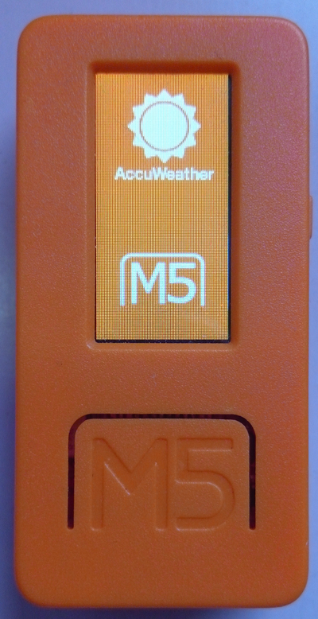
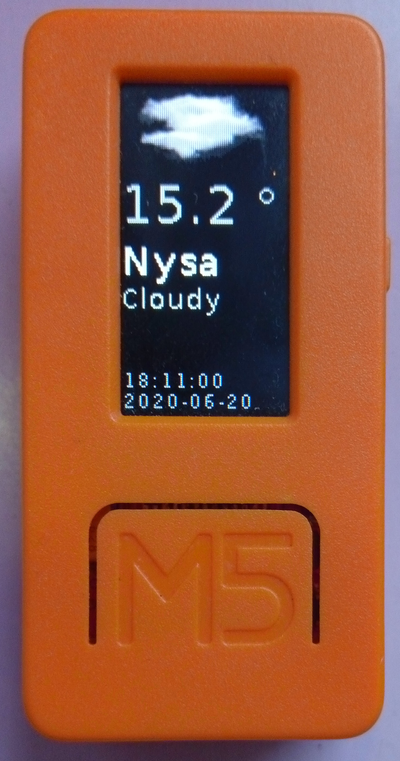

# Accuweather M5stickC example program

Example program which use REST API with accuweather.com to get weather data from service.
Code was tested on UiFlow web IDE 1.4.5 and m5stickc 1.4.2 firmware.
You must change the **Api Key** and find **city id** for your city and change it in code.
In free trial account you have limit of 50 requests per day. On device when you press **M5** (button A) button then weather data was refreshed.

### How to get your Api Key:
 - create account on https://developer.accuweather.com/user/login
 - after create account and login click "add new app" and get API Key

### How to find city ID for your city:
 - open https://developer.accuweather.com/accuweather-locations-api/apis/get/locations/v1/cities/search
 - fill field **apikey** with your api key and **q** with your city name to search in *Query Parameters* section
 - click **Send this request**

## Code

## Additional resources
In UiFlow you must load custom block [accuweather.m5b](https://github.com/stonatm/UiFlow-custom-blocks/blob/master/accuweather/accuweather.m5b)
You must transfer all jpeg files from [/res](**/res**) folder used by code into **/res** folder in your m5stickc device. You can use Resource Manager from UiFlow Web IDE (by this tool you place files directly in correct place in flash).

## overview

