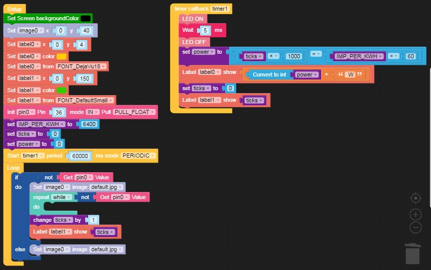
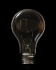
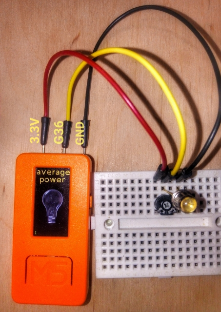
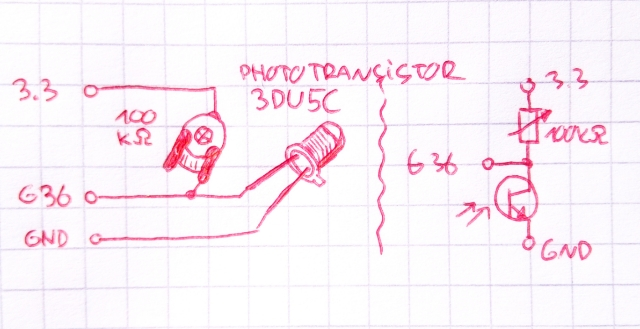

# M5stickC average power consumption meter

A simple program showing the average power consumption of loads connected to the home electrical network. The program counts the LED flashes in the electronic electricity meter. For correct calculations, read the value of the number of pulses per 1kWh from the meter and change the variable **IMP_PER_KWH** in the program. The light sensor (phototransistor) used should be placed as close as possible to the flashing diode in the meter. At the top of the m5stick's display the calculated average power consumption in watts is displayed (after the first connection the result will appear only after a minute). The bulb icon on the display changes ("lights") when the flash is correctly read. You can change the position of the potentiometer to change the sensitivity of the sensor to light. Ultimately, you can measure the resistance value of the potentiometer and replace it with a suitable resistor. The number of counted flashes is displayed at the bottom of the screen. The displayed values are updated every minute. The power measurement is the average of the last minute and is only suitable for approximate display of energy consumption.

## Uiflow code

uiflow code: [aver_pow.m5f](aver_pow.m5f)

automatically generated python code: [aver_pow.py](aver_pow.py)

## Additional resources

You must transfer two jpeg files used by code. [bulb_on.jpg](bulb_on.jpg) and [bulb_of.jpg](bulb_of.jpg) to **/res** folder in your m5stickc device. You can use Resource Manager from UiFlow Web IDE (by this tool you place files directly in correct place in flash)

## Wiring diagram
components  used:

- **3du5c** phototransistor

- **100kohm** potentiometer

